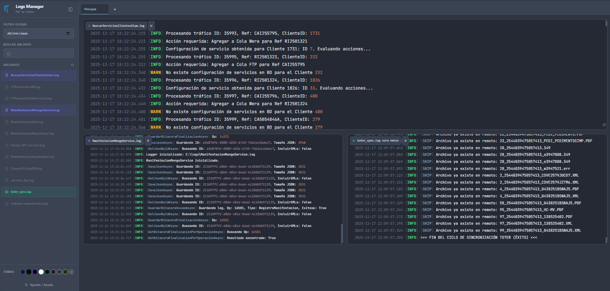
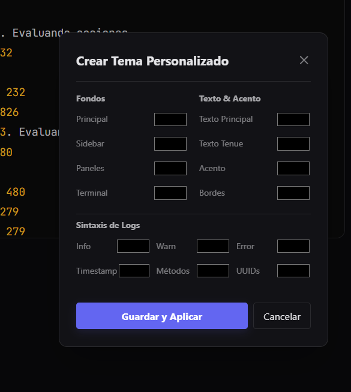
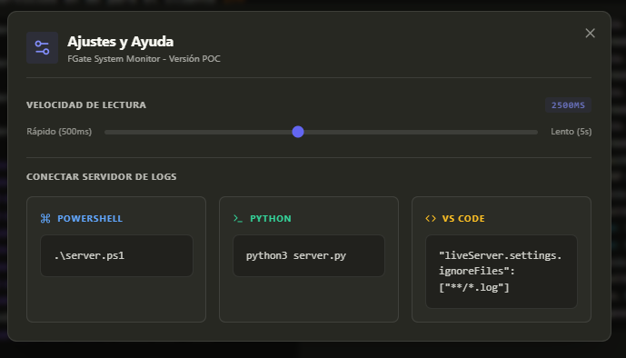

# FGate Logs Manager (POC)

 

**Importante:** Este proyecto es una Prueba de Concepto (POC). Está diseñado para visualización rápida y monitoreo ligero en entornos de desarrollo local. Úsalo como base para integrarlo en backends más robustos (.NET, Node, Python) si necesitas un entorno de producción.

> **¿El plan a futuro?**
> Originalmente construí este proyecto como base para integrarlo en mis propios sistemas (backend .NET y Python), así que es probable que mi foco se centre en esa implementación privada y no actualice este repositorio con mucha frecuencia.
>
> Si te sirve tal cual, genial. Pero si quieres mejorarlo o agregar funciones, te invito totalmente a contribuir con tus Pull Requests.
>
> Realmente espero que este repositorio pueda serles de utilidad.

## Tabla de Contenidos

- [Pruébalo Ahora](#pruébalo-ahora)
- [Descripción](#descripción)
- [Características](#características)
- [Limitaciones](#limitaciones-client-side)
- [Instalación](#instalación-y-uso)
- [Configuración](#configuración)
- [Extensibilidad](#extensibilidad-y-personalización)
- [Contribución](#contribución)

## Pruébalo Ahora

¿Quieres probar rápido? Solo tres pasos:

1. **Prepara tus archivos:** Apunta los logs de tus servicios a la carpeta `/logsPath` (o crea tu propia estructura de carpetas a nivel del sever script que uses). Esta "limitante" de ubicación es solo para esta POC; en una implementación con backend real, podrás aplicar tu propia lógica para leer archivos desde cualquier path del servidor.

2. **Lanza el servidor:** Ejecuta `.\server.ps1` en la raíz con PowerShell. Si prefieres usar Python, tienes el script listo en `python "scripts mini servers/server.py"`.

3. **Monitorea:** Abre `http://localhost:5050` en tu navegador.

¡Listo! Los logs se actualizan en tiempo real. Para que tus archivos aparezcan siempre al iniciar, agrégalos a la lista `AUTO_LOAD_FILES` dentro de `js/state.js`.

---

## Descripción

FGate Logs Manager es un visualizador de logs en tiempo real construido con tecnologías web estándar (HTML5, JS, CSS3). La idea es tener una interfaz limpia y configurable para ver múltiples archivos de registro a la vez sin tener que montar stacks pesados como ELK para tareas sencillas.

Publiqué el proyecto con la intención de que sirva como una plantilla frontend adaptable. Aunque funciona por sí solo leyendo archivos locales, su verdadero potencial está cuando se conecta a un backend real que gestione la lectura de archivos del servidor.

## Interfaz

#### Interfaz


#### Multi-Pestañas


#### Temas


#### Tema Customizable


#### Tasa de Refresco


## Características

* **Grid Dinámico:** Permite visualizar varios logs simultáneamente.
* **Drag & Resize:** Puedes reordenar y cambiar el tamaño de los paneles arrastrándolos.
* **Temas Visuales:** Incluye varios modos (Obsidian, Draco, Paper) y el tema por defecto FGate (Azul/Gris).
* **Live Polling:** El contenido se actualiza solo sin recargar la página (el intervalo es configurable).
* **Filtros:**
    * *Global:* Por fecha en todos los archivos.
    * *Local:* Por texto o nivel de log (INFO, WARN, ERROR) en cada panel.
* **Sintaxis Resaltada:** Detecta y colorea automáticamente Timestamps, UUIDs, Métodos y niveles de error.
* **Pestañas:** Gestión de sesiones de monitoreo por tabs.

## Limitaciones (Client-Side)

Al ser una versión que corre puramente en el navegador sin un backend dedicado, tiene limitaciones técnicas:

**Ubicación de archivos:** Para que el navegador pueda leer los logs mediante *polling* y que se actualicen en tiempo real, los archivos `.log` deben estar en el mismo directorio que el `index.html`.

**Solución:** Si integras este frontend con una API (REST o WebSockets), esta limitación desaparece.

### Solución Alternativa (Modo Puente)

Para superar esta limitación sin mover tus archivos de log, el proyecto incluye **Servidores Puente** en la carpeta `scripts mini servers/`. Estos scripts levantan un servidor local que tiene permisos de sistema para leer cualquier ruta absoluta y exponerla al frontend.

> **Recomendación:** Si tus logs están dispersos en diferentes discos o carpetas del sistema, ve directo a la sección:
> [👉 Configurar Modo Avanzado (Modo Puente)](#modo-avanzado-lectura-de-rutas-absolutas-modo-puente)

## Instalación y Uso

### Estructura de archivos
Para probarlo, simplemente coloca tus logs en la carpeta `logsPath/` o crea tu propia estructura de carpetas y logs:

```text
/Logs Manager POC FGate/
├── index.html            <-- Entry Point (la UI principal)
├── server.ps1            <-- Script de arranque rápido (PowerShell)
├── assets/
│   ├── style.css         <-- Definición de temas y estilos
│   └── imgs/
├── js/                   <-- Lógica modular (ES Modules)
│   ├── main.js           <-- Inicialización y eventos globales
│   ├── state.js          <-- Configuración (aquí registras tus logs)
│   ├── logs.js           <-- Core: Polling, lectura y parseo de líneas
│   ├── grid.js           <-- Motor del layout dinámico (Grid)
│   ├── theme.js          <-- Gestor de temas y personalización
│   ├── session.js        <-- Persistencia (LocalStorage)
│   └── ... (otros módulos de UI, pestañas y utilidades)
├── logsPath/             <-- Tus archivos .log van aquí
└── scripts mini servers/ <-- Scripts alternativos (Python) y configs

```

### Cómo ejecutarlo

No es necesario configurar un servidor web complejo; basta con servir los archivos estáticos. He incluido dos scripts de "tiny servers" para las pruebas: puedes utilizar el que prefieras o crear uno propio.

**Opción A: PowerShell (Windows) Recomendado**

Es la opción más directa en Windows. Ejecuta el script ubicado en la raíz del proyecto:

```powershell
.\server.ps1

```

El servidor se levantará automáticamente en `http://localhost:5050`.

**Opción B: Python (Multi-plataforma)**

Si cuentas con Python 3, puedes ejecutar el script de soporte:

```bash
python "scripts mini servers/server.py"

```

O bien, utiliza el comando nativo en el puerto correspondiente:

```bash
python3 -m http.server 5050

```

**Opción C: VS Code**

Utiliza la extensión "Live Server" haciendo clic derecho sobre `index.html` -> "Open with Live Server".

Para evitar que la herramienta refresque la página cada vez que un archivo `.log` reciba información, he incluido un archivo de configuración en la carpeta `scripts mini servers`. Debes agregar este `settings.json` a tu carpeta local `.vscode/`:

```json
/* Agrega este archivo json a tu carpeta /.vscode si utilizas
la extensión de Live Server para evitar la recarga automática */
{
    "liveServer.settings.ignoreFiles": [
        "**/*.log"
    ]
}

```
## Modo Avanzado: Lectura de Rutas Absolutas (Modo Puente)

Por seguridad, los navegadores no pueden leer archivos fuera de la carpeta del proyecto (como `C:\Windows\System32\...` o `/var/log/...`).
Si necesitas monitorear logs en rutas absolutas sin moverlos de su lugar, utiliza los **Scripts Inyectores** ubicados en `scripts mini servers/`.
Estos scripts funcionan como un "Puente" y realizan 3 acciones automáticas:

1. **Validan** qué archivos existen realmente en tu disco.
2. **Inyectan** la configuración temporalmente en `js/state.js`.
3. **Inician** el servidor y abren el navegador.

### Paso 1: Configurar Rutas

Abre el script que prefieras (`.ps1` o `.py`) y edita la variable de mapeo al inicio del archivo:

**En PowerShell (`server_js_injector.ps1`):**

```powershell
$LogMapping = @{
    "IIS_Log"   = "C:\inetpub\logs\LogFiles\W3SVC1\u_ex231201.log"
    "MiApp"     = "D:\Proyectos\Backend\logs\error.log"
}

```

**En Python (`server_js_injector_python.py`):**

```python
LOG_MAPPING = {
    "Syslog": "/var/log/syslog",
    "App_Win": r"C:\Users\MiUsuario\Documents\app.log"
}

```

### Paso 2: Ejecutar

Desde la terminal, en la raíz del proyecto:

#### Opción PowerShell (Windows)

```powershell
# Iniciar servidor y abrir navegador automáticamente
.\scripts mini servers\server_js_injector.ps1 -Open

```

#### Opción Python (Windows / Linux / Mac)

```bash
# Iniciar servidor y abrir navegador automáticamente
python "scripts mini servers/server_js_injector_python.py" --open

```

> **Nota:** Al detener el servidor (Ctrl+C), el script **restaurará automáticamente** el archivo `js/state.js` a su estado original, dejando tu proyecto limpio.
## Configuración

Para definir qué archivos cargan automáticamente al abrir la app, edita la lista `AUTO_LOAD_FILES` en `js/state.js`:

```javascript
export var AUTO_LOAD_FILES = [
    "syslog.log",
    "servicio1.log",
    "servicio12.log",
    // Agrega aquí tus archivos
];

```

## Extensibilidad y Personalización

He centralizado toda la lógica de visualización en `js/logs.js` para que sea fácil de adaptar.

El parseo de líneas ocurre específicamente en la función `formatLogLine()`. Ahí puedes inyectar tus propios `.replace()` con Regex para detectar IDs, códigos de error o lo que use tu sistema.

```javascript
export function formatLogLine(line) {
    let safeLine = line.replace(/&/g, "&amp;").replace(/</g, "&lt;").replace(/>/g, "&gt;");
    let lineClass = "";
    if (safeLine.match(/ERROR|EXCEPTION|FAIL|CRITICAL/i)) lineClass = "line-err";

    // --- REGLAS DE RESALTADO (SYNTAX HIGHLIGHTING) ---

    // A. Fechas (Timestamps): 2024-12-01 10:00:00
    safeLine = safeLine.replace(
        /^(\d{4}-\d{2}-\d{2}\s+\d{2}:\d{2}:\d{2}(\.\d{3})?)/,
        '<span class="t-ts">$1</span>'
    );

    // B. Niveles de Log: [INFO], [ERROR], etc.
    safeLine = safeLine.replace(
        /\[(INFO|WARN|ERROR|DEBUG|FATAL|TRACE)\]/g,
        (match, p1) => `<span class="t-br">[</span><span class="t-${p1.toUpperCase()}">${p1}</span><span class="t-br">]</span>`
    );

    // C. Clases/Métodos entre corchetes: [MiServicio]
    safeLine = safeLine.replace(
        /\[([a-zA-Z0-9_\-\.]+)\]/g,
        '<span class="t-br">[</span><span class="t-mt">$1</span><span class="t-br">]</span>'
    );

    // D. UUIDs: Detecta patrones tipo 550e8400-e29b-...
    safeLine = safeLine.replace(
        /\b[0-9a-fA-F]{8}-[0-9a-fA-F]{4}-[0-9a-fA-F]{4}-[0-9a-fA-F]{4}-[0-9a-fA-F]{12}\b/g,
        '<span class="t-id">$&</span>'
    );

    // E. Números sueltos: IDs, puertos, contadores
    safeLine = safeLine.replace(
        /(:\s+|=|\s)(\d+)(\s|$|\.)/g,
        '$1<span class="t-nm">$2</span>$3'
    );

    return `<div class="log-line ${lineClass}">${safeLine}</div>`;
}

```

Para agregar nuevas reglas:

1. Edita la función `formatLogLine()` en `js/logs.js`.
2. Agrega tus propias expresiones regulares (Regex) con `.replace()`.
3. Define los colores correspondientes en `assets/style.css` usando las variables CSS existentes (se ajustan limpiamente sin tocar JS).

> **Para después:** Sé que editar código para cambiar un color no es lo ideal. Tal vez después podría construir una interfaz visual (UI) integrada, para que puedas crear y guardar tus propias reglas de resaltado directamente desde el navegador sin tocar la lógica de los scripts.

## Contribución

El proyecto es Open Source (Licencia MIT). Sé que el código puede mejorar (especialmente en rendimiento del DOM o estructura), ya que se construyó rápido como una prueba de concepto.

Si quieres optimizarlo, migrarlo a React/Vue o conectarlo a un backend real, eres bienvenido a hacer un fork y enviar tus PRs.